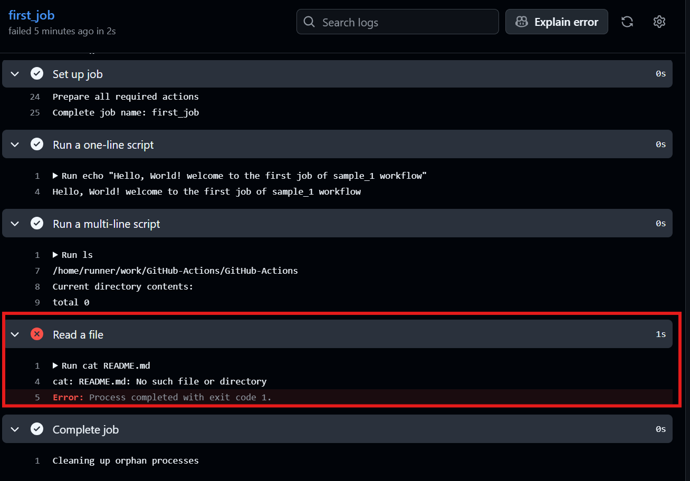

# This is the reason why first_workflow has failed

[Failed Job](https://github.com/adithejas/GitHub-Actions/actions/runs/31667120144)

> [!WARNING]
> **Missing Repository Checkout Step**
>
> 
> Running file commands like `cat README.md` will fail with `cat: README.md: No such file or directory` if the repository files are not checked out first. In GitHub Actions workflows, jobs run in an isolated virtual machine and do not contain your repository files by default.
>
> **Solution:** Ensure `actions/checkout` is included as the first step in your job:
>
> ```yaml
> steps:
>   - name: Checkout repository
>     uses: actions/checkout@v4
> ```
